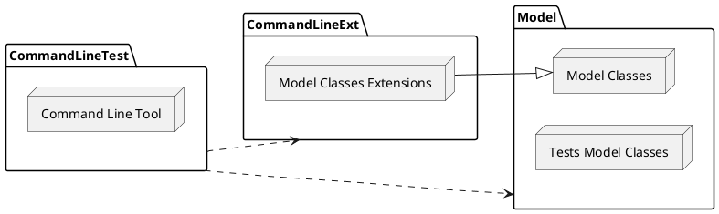
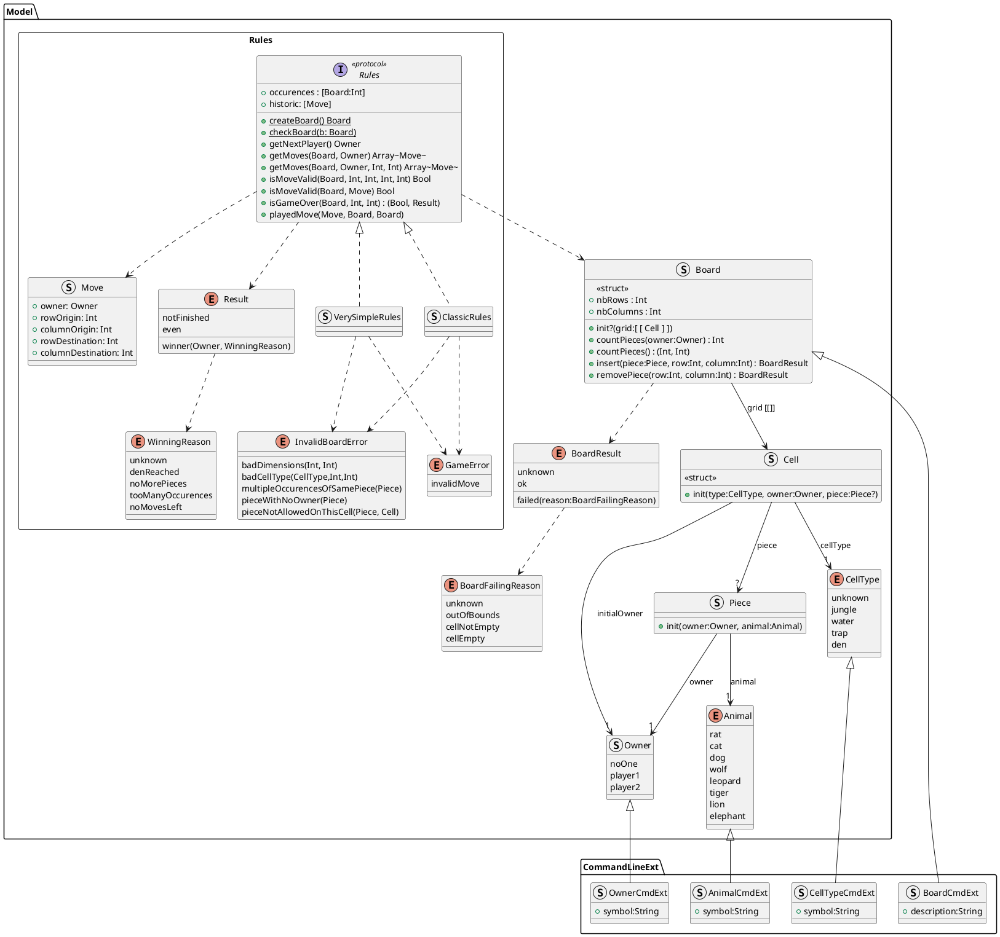

[](https://codefirst.iut.uca.fr/axel.de_la_fuente/DouShouQi)

### Built with


<div align="center">
    <h1>DouShouQi</h1>
    
</div>

# Getting started

Clone the repository :

```shell
git clone https://codefirst.iut.uca.fr/git/axel.de_la_fuente/DouShouQi.git
```

Build dependencies :

```shell
cd ./Sources/Model/
swift build
cd ../CommandLineExt/
swift build
```

Run the app :

```shell
cd ../CommandLineTest/
swift run
```

# Tests

Tests can be launch by using the following commands :

```shell
cd ./Sources/Model/
swift test
```

# Architecture diagram



# Model & Extensions - class diagram



# Author

- [Axel DE LA FUENTE](https://codefirst.iut.uca.fr/git/axel.de_la_fuente)

# Acknowledgements

Thanks to my professor for his guidance and feedback throughout the development of this project.

- Marc CHEVALDONNE
